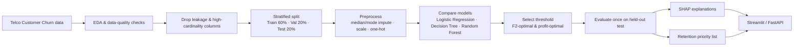
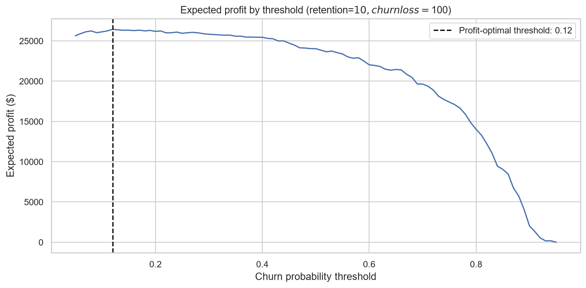
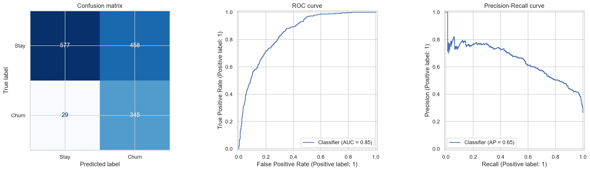
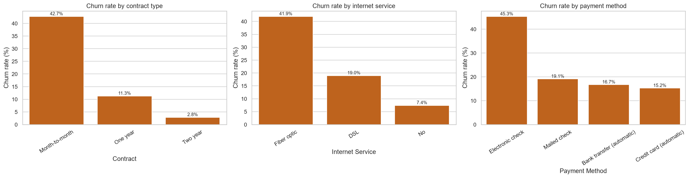
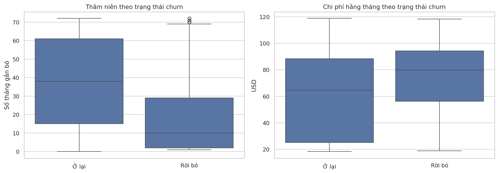

# Telco Customer Churn Prediction

[](https://www.python.org/)
[](https://scikit-learn.org/)

A production-shaped, cost-aware churn model for a telecom operator: it predicts which customers are about to leave, explains *why*, and tells the retention team who is worth calling first — with an actual dollar figure behind that recommendation, not just an accuracy score.

---

## 1. Business context

Losing a customer is expensive. In telecom, replacing a churned subscriber typically costs far more than retaining an existing one through a discount, a call, or a service fix. The business questions this project answers are:

1. **Who is likely to churn in the near future?**
2. **Which of those customers should we actually spend retention budget on?** (Not everyone flagged as "at risk" is worth contacting — false alarms cost money too.)
3. **What's driving churn**, so retention offers and product fixes can be targeted rather than generic?

The dataset is the public [Telco Customer Churn](https://www.kaggle.com/datasets/ylchang/telco-customer-churn-1113) dataset (7,043 customers, 26.5% churn rate) — account details, contract terms, service subscriptions, and billing.

Because a missed churner is worse than an unnecessary retention call, the model is tuned to **favor recall** (catching churners) over raw accuracy, using the F2 score and, additionally, an explicit **cost-benefit threshold** grounded in retention economics (Section 4).

## 2. Repository structure

```text
.
├── data/                    # Telco_customer_churn.xlsx goes here (gitignored)
├── notebooks/
│   └── 01_eda_training_colab.ipynb   # original self-contained Colab notebook (EDA -> training -> export)
├── src/                     # Production-shaped pipeline
│   ├── config.py            #   paths, feature lists, business cost assumptions
│   ├── data_loader.py       #   Kaggle download + leakage-safe X/y split
│   ├── preprocessing.py     #   ColumnTransformer (impute, scale, one-hot)
│   ├── train.py             #   model comparison -> threshold selection -> test eval -> save model
│   ├── cost_benefit.py      #   expected-profit threshold optimization (Step 2)
│   ├── explain.py           #   SHAP summary + per-customer waterfall (Step 2)
│   └── predict.py           #   CLI: score a new customer file with the saved model
├── app/
│   ├── streamlit_app.py     #   interactive single-customer scoring UI + SHAP waterfall
│   └── api.py                #   FastAPI POST /predict service
├── models/                  # churn_pipeline.joblib goes here after training (gitignored)
├── outputs/                 # metrics tables, figures, and the retention priority list
├── tests/                   # unit tests for cost-benefit math and preprocessing
├── requirements.txt
└── LICENSE
```

The original all-in-one Colab notebook is kept under `notebooks/` for a fast, dependency-light way to reproduce the analysis; `src/` is the same logic refactored into importable, testable modules for local development, the apps, and CI.

## 3. Processing pipeline



Columns at risk of leaking the label (`Churn Value`, `Churn Score`, `Churn Reason`) are dropped before training, along with pure identifiers/constants (`CustomerID`, `Count`, `Country`, `State`) and duplicated geo columns (`Lat Long`, `Latitude`, `Longitude`).

**Change from the original notebook:** `City` (1,129 unique values) and `Zip Code` (1,652 unique values) are now also excluded. One-hot encoding them would add over a thousand sparse columns for very little predictive signal beyond what `Internet Service`/`Contract`/pricing already capture, and invites overfitting to location noise. This is a deliberate simplification, not an oversight — see `src/config.py` for the full rationale.

Numeric features (`Tenure Months`, `Monthly Charges`, `Total Charges`, `CLTV`) are median-imputed and standardized; categorical features are mode-imputed and one-hot encoded, inside a single `sklearn.pipeline.Pipeline` so training and inference always apply identical transforms.

## 4. Model benchmark

Three models are trained with `class_weight="balanced"` (the churn class is a minority) and compared on the validation split by PR-AUC:

| Model | ROC-AUC | PR-AUC | Accuracy | Precision (churn) | Recall (churn) | F1 (churn) | F2 (churn) |
|---|---:|---:|---:|---:|---:|---:|---:|
| **Random Forest** | **0.842** | **0.639** | 0.744 | 0.511 | 0.802 | 0.624 | 0.720 |
| Logistic Regression | 0.841 | 0.638 | 0.758 | 0.531 | 0.749 | 0.622 | 0.692 |
| Decision Tree | 0.841 | 0.616 | 0.757 | 0.528 | 0.794 | 0.635 | 0.722 |

Random Forest wins on PR-AUC — the right metric here since churn is the minority, less-common class — and is carried forward as the production model. All three are close on ROC-AUC, which is a reminder that *threshold choice*, not just model choice, is where most of the practical performance comes from (next section).

### Threshold selection: F2 vs. expected profit

Two independent threshold-selection methods were compared on the validation set (374 actual churners, 1,035 non-churners):

| Threshold rule | Threshold | TP | FP | FN | Interpretation |
|---|---:|---:|---:|---:|---|
| **F2-optimal** (recall-weighted) | **0.37** | 352 | 509 | 22 | Maximizes F2 = catches 94% of churners |
| Expected-profit-optimal | 0.37 | 352 | 509 | 22 | Maximizes $ profit under the cost model below |
| Naive default | 0.50 | 300 | 287 | 74 | scikit-learn's implicit default |
| Contact everyone | ~0.10 | 374 | 1,035 | 0 | No model needed |

Under a simple retention-economics assumption — **contacting a customer costs \$10**, **losing one to churn costs \$100** (`RETENTION_COST` / `CHURN_LOSS` in `src/config.py`) — expected profit is `90 × TP − 10 × FP` at each threshold:



| Threshold | Expected profit (validation) |
|---|---:|
| 0.37 (chosen) | **$26,590** |
| 0.50 (naive default) | $24,130 |
| Contact everyone | $23,310 |

**Finding:** the F2-optimal threshold and the profit-optimal threshold land on the *same* value, 0.37, given these cost assumptions — switching from the naive 0.50 default to 0.37 is worth roughly **\$2,460 more expected profit per validation-sized batch (~1,400 customers)**, purely from a better cutoff, no retraining required. That said, this is one cost assumption; `src/cost_benefit.py` recomputes the curve for any `RETENTION_COST` / `CHURN_LOSS` pair, since real retention-offer cost and real customer LTV will vary by segment and should be revisited with actual finance numbers.

### Held-out test performance (threshold = 0.37)

A single, final evaluation on the untouched test set (1,409 customers, never used for model or threshold selection):

| Metric | Value |
|---|---:|
| ROC-AUC | 0.836 |
| PR-AUC | 0.635 |
| Accuracy | 0.627 |
| Precision (churn) | 0.408 |
| Recall (churn) | 0.906 |
| F1-score (churn) | 0.563 |
| F2-score (churn) | 0.729 |

|  | Predicted: Stay | Predicted: Churn |
|---|---:|---:|
| **Actual: Stay** | 544 | 491 |
| **Actual: Churn** | 35 | 339 |



The model catches **90.6% of actual churners** at the cost of a lot of false alarms (precision 0.41) — a deliberate trade-off given that a missed churner (\$100 loss) is worth far more than a wasted retention call (\$10). Accuracy alone (0.63) would look mediocre and is the wrong headline metric for this problem.

## 5. Key insights

- **Contract type is the single strongest churn signal.** Month-to-month customers churn at **42.7%**, vs. 11.3% for one-year and just 2.8% for two-year contracts.
- **Payment method matters almost as much.** Electronic check customers churn at **45.3%**, roughly 3x the rate of automatic bank transfer or credit card payers (15–17%).
- **Fiber optic internet customers churn more (41.9%)** than DSL (19.0%) or no-internet customers (7.4%) — likely a mix of price sensitivity and service-quality friction.
- **New, lower-spend-tenure customers are most at risk:** churned customers have a median tenure of ~10 months vs. ~38 months for retained customers, and skew toward higher monthly charges early on.

  
  

These four features — contract, payment method, internet service, tenure — are exactly what a SHAP summary plot on the trained Random Forest is expected to surface as top global drivers. `src/explain.py` implements that SHAP analysis (`TreeExplainer` on the Random Forest, `KernelExplainer` as a fallback for linear models) and the Streamlit app renders a per-customer SHAP waterfall live; generating `outputs/06_shap_summary.png` and confirming the exact SHAP ranking requires running `python -m src.train` locally with `data/Telco_customer_churn.xlsx` present (this environment has no internet access to download the dataset, so that plot isn't included as a static file here — see Setup below).

## 6. Setup & quickstart

### Install

```bash
git clone https://github.com/Tomato2312/Customer-Churn-Prediction-Using-Supervised-Learning
cd telco-churn-prediction
python -m venv .venv
source .venv/bin/activate        # Windows: .venv\Scripts\Activate.ps1
pip install --upgrade pip
pip install -r requirements.txt
```

### Get the data

Either download `Telco_customer_churn.xlsx` manually from [Kaggle](https://www.kaggle.com/datasets/ylchang/telco-customer-churn-1113) into `data/`, or authenticate the Kaggle CLI (`~/.kaggle/kaggle.json`) and let the loader fetch it:

```bash
python -c "from src.data_loader import download_dataset; download_dataset()"
```

### Train

```bash
python -m src.train
```

This runs the full pipeline (EDA exports → model comparison → F2 and profit-optimal threshold selection → held-out test evaluation → retention priority list) and writes:
- Tables and figures to `outputs/`
- The fitted `Pipeline` to `models/churn_pipeline.joblib`
- `outputs/X_test_sample.csv`, a background sample used by `src/explain.py` and the Streamlit app for SHAP

### Generate SHAP explanations

```bash
python -m src.explain          # writes outputs/06_shap_summary.png
```

### Score new customers

```bash
python -m src.predict --input new_customers.csv --output scored.csv --threshold 0.37
```

```python
import pandas as pd
priority = pd.read_csv("outputs/retention_priority_list.csv")
priority[priority["Action"] == "Priority retention contact"].head(20)
```

### Run the interactive app

```bash
streamlit run app/streamlit_app.py
```

Enter a customer profile in the sidebar to get a live churn probability, the recommended action at your chosen threshold, and a SHAP waterfall explaining that specific prediction.

### Run the REST API

```bash
uvicorn app.api:app --reload --port 8000
# then:
curl -X POST http://localhost:8000/predict \
  -H "Content-Type: application/json" \
  -d '{"Gender":"Female","Senior Citizen":"No","Partner":"Yes","Dependents":"No",
       "Tenure Months":5,"Phone Service":"Yes","Multiple Lines":"No",
       "Internet Service":"Fiber optic","Online Security":"No","Online Backup":"No",
       "Device Protection":"No","Tech Support":"No","Streaming TV":"No",
       "Streaming Movies":"No","Contract":"Month-to-month","Paperless Billing":"Yes",
       "Payment Method":"Electronic check","Monthly Charges":85.05,
       "Total Charges":425.25,"CLTV":3200}'
```

### Run tests

```bash
pytest tests/
```

### Reproduce via the original notebook

The original self-contained Colab notebook is preserved at `notebooks/01_eda_training_colab.ipynb` and can still be run top-to-bottom on Colab (`Runtime → Run all`) as a dependency-light alternative to the `src/` scripts.

## 7. Algorithms and formulas

<details>
<summary>Preprocessing, model math, and metric definitions</summary>

**Standardization** (numeric features): $z = \dfrac{x - \mu}{\sigma}$, with $\mu,\sigma$ fit on the training split only.

**Logistic Regression**: $p(y=1\mid x) = \sigma(\beta_0 + \sum_j \beta_j x_j)$, trained by minimizing binary cross-entropy. `LogisticRegression(max_iter=2000, class_weight="balanced")`.

**Decision Tree**: splits chosen to maximize the Gini impurity reduction $\Delta G = G(m) - \frac{n_L}{n_m}G(L) - \frac{n_R}{n_m}G(R)$, where $G(m) = 1 - \sum_k p_{mk}^2$. `DecisionTreeClassifier(max_depth=6, min_samples_leaf=20, class_weight="balanced")`.

**Random Forest**: bagged ensemble of $B$ trees, $\hat p_{RF}(y=1\mid x) = \frac{1}{B}\sum_b \hat p_b(y=1\mid x)$. `RandomForestClassifier(n_estimators=400, max_depth=12, min_samples_leaf=5, class_weight="balanced")`.

**Thresholded prediction**: $\hat y = \mathbb{1}[p(y=1\mid x) \ge t]$, with $F_\beta = (1+\beta^2)\dfrac{\text{Precision}\cdot\text{Recall}}{\beta^2\text{Precision}+\text{Recall}}$; $\beta{=}2$ weights recall more heavily, matching the business cost of missing a churner.

**Expected profit** at threshold $t$: $\text{Profit}(t) = (\text{CHURN\_LOSS} - \text{RETENTION\_COST})\cdot TP(t) - \text{RETENTION\_COST}\cdot FP(t)$ — see `src/cost_benefit.py`.

</details>
