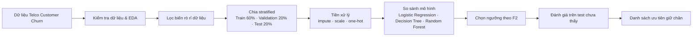

# Dự báo rời bỏ khách hàng

[](https://www.python.org/)
[](https://colab.research.google.com/)
[](LICENSE)
[](Customer_Churn_Colab_Standalone.ipynb)

Mô hình dự báo xác suất một khách hàng viễn thông sẽ rời bỏ dịch vụ (*customer churn*). Dự án thực hiện khám phá dữ liệu, so sánh ba mô hình phân loại và xuất danh sách khách hàng cần ưu tiên giữ chân để hỗ trợ đội ngũ kinh doanh.

## Tổng quan

Churn làm giảm doanh thu và thường tốn kém hơn nhiều so với việc giữ chân khách hàng hiện tại. Mô hình này nhận diện sớm nhóm có nguy cơ rời bỏ từ thông tin dịch vụ, hợp đồng, thời gian gắn bó và chi phí; ngưỡng dự đoán được chọn theo điểm F2 để ưu tiên **recall** cho các chiến dịch can thiệp giữ chân.

Nguồn dữ liệu là bộ [Telco Customer Churn](https://www.kaggle.com/datasets/ylchang/telco-customer-churn-1113) công khai trên Kaggle. Notebook sẽ tự tải tệp Excel khi chạy trên Colab có Internet.



## Cấu trúc thư mục

```text
.
├── Customer_Churn_Colab_Standalone.ipynb  # Toàn bộ quy trình EDA, huấn luyện và dự báo
├── requirements.txt                       # Các thư viện Python cần thiết
├── LICENSE                                # Giấy phép MIT
└── outputs/                               # Báo cáo, chỉ số và danh sách hành động sinh ra khi chạy
    ├── validation_model_comparison.csv
    ├── threshold_selection.csv
    ├── test_metrics.csv
    ├── classification_report.csv
    └── retention_priority_list.csv
```

- `data/` được notebook tạo tự động và chứa `Telco_customer_churn.xlsx` tải từ Kaggle; thư mục này không được đưa vào repository.
- `outputs/` lưu các bảng kết quả và, sau khi chạy notebook, các biểu đồ EDA/đánh giá (`01_...png` đến `05_test_evaluation.png`).
- Notebook thay thế cho các thư mục `src/`, `notebooks/` và `models/`: toàn bộ pipeline được đóng gói trong một tệp Colab tự chạy.

## Cài đặt

### Chạy trên máy cục bộ

```bash
git clone https://github.com/Tomato2312/Customer-Churn-Prediction-Using-Supervised-Learning
cd PROJECTS-DATAMINING
python -m venv .venv
```

Kích hoạt môi trường ảo:

```powershell
# Windows PowerShell
.\.venv\Scripts\Activate.ps1
```

```bash
# macOS / Linux
source .venv/bin/activate
```

Cài các thư viện:

```bash
python -m pip install --upgrade pip
pip install -r requirements.txt
```

### Chạy trên Google Colab

1. Tải `Customer_Churn_Colab_Standalone.ipynb` lên Google Colab hoặc mở tệp từ GitHub.
2. Chọn **Runtime → Run all**. Cell đầu tiên cài thư viện, sau đó notebook tải dữ liệu Kaggle công khai và chạy toàn bộ pipeline.
3. Cell cuối tạo `customer_churn_outputs.zip` để tải các kết quả về máy.

## Sử dụng

### Huấn luyện và đánh giá

Notebook là điểm chạy chính. Sau khi đã cài môi trường cục bộ, khởi động Jupyter:

```bash
jupyter notebook Customer_Churn_Colab_Standalone.ipynb
```

Trong giao diện Jupyter, chọn **Run All Cells**. Hoặc chạy không giao diện để tái tạo kết quả:

```bash
jupyter nbconvert --to notebook --execute --inplace Customer_Churn_Colab_Standalone.ipynb
```

Lệnh trên bao gồm huấn luyện, chọn mô hình/ngưỡng và đánh giá; dữ liệu được tải tự động nếu chưa có `data/Telco_customer_churn.xlsx`.

### Dự đoán và ưu tiên giữ chân

Phiên bản hiện tại không có `inference.py` độc lập: cell cuối của notebook chính là bước suy luận. Sau khi chạy, mở danh sách dự đoán đã sắp theo xác suất churn giảm dần:

```python
import pandas as pd

priority = pd.read_csv("outputs/retention_priority_list.csv")
priority.head(20)
```

Các khách hàng có `Action = "Ưu tiên liên hệ giữ chân"` là những trường hợp vượt ngưỡng F2 tối ưu. Để dự báo dữ liệu mới trong phiên bản hiện tại, hãy thay dữ liệu nguồn bằng tệp có cùng schema, rồi chạy lại toàn bộ notebook; pipeline sẽ tự huấn luyện lại và xuất danh sách mới.

## Thuật toán và công thức

Pipeline xử lý biến số bằng median imputation và chuẩn hoá, xử lý biến phân loại bằng mode imputation và one-hot encoding. Với StandardScaler, một giá trị được biến đổi theo:

$$
z = \frac{x - \mu}{\sigma}
$$

Trong đó $\mu$ là trung bình và $\sigma$ là độ lệch chuẩn của tập huấn luyện. Các cột có nguy cơ rò rỉ dữ liệu như `Churn Value`, `Churn Score` và `Churn Reason` được loại bỏ trước khi huấn luyện.

### Logistic Regression

Đây là mô hình cơ sở dễ diễn giải: mô hình hoá quan hệ tuyến tính giữa đặc trưng và log-odds churn, rồi đổi sang xác suất bằng sigmoid.

$$
z = \beta_0 + \sum_{j=1}^{p}\beta_jx_j,
\qquad
p(y=1\mid x) = \frac{1}{1+e^{-z}}
$$

Mô hình tối thiểu hoá binary cross-entropy:

$$
\mathcal{L} = -\frac{1}{n}\sum_{i=1}^{n}[y_i\log(p_i)+(1-y_i)\log(1-p_i)]
$$

Trong notebook: `LogisticRegression(max_iter=2000, class_weight="balanced")`. Đây là baseline tốt, nhưng khó nắm bắt tương tác phi tuyến phức tạp.

### Decision Tree

Decision Tree tạo các quy tắc “nếu/thì” để chia khách hàng thành các nhóm ngày càng thuần nhất. Mỗi phép chia được chọn để giảm Gini impurity lớn nhất:

$$
G(m) = 1 - \sum_{k=1}^{K}p_{mk}^{2}
$$

$$
\Delta G = G(m) - \frac{n_L}{n_m}G(L) - \frac{n_R}{n_m}G(R)
$$

Trong notebook: `DecisionTreeClassifier(max_depth=6, min_samples_leaf=20, class_weight="balanced")`. Cây dễ giải thích và nhận diện tương tác phi tuyến, nhưng một cây đơn lẻ có thể kém ổn định.

### Random Forest

Random Forest kết hợp nhiều Decision Tree học từ các mẫu bootstrap và tập con đặc trưng ngẫu nhiên. Điều này giảm phương sai và thường tổng quát hoá tốt hơn một cây đơn.

$$
\hat{p}_{RF}(y=1\mid x) = \frac{1}{B}\sum_{b=1}^{B}\hat{p}_b(y=1\mid x)
$$

Trong đó $B$ là số cây. Notebook dùng `RandomForestClassifier(n_estimators=400, max_depth=12, min_samples_leaf=5, class_weight="balanced")`. Đây là mô hình được chọn do PR-AUC validation cao nhất; đổi lại, độ diễn giải thấp hơn Logistic Regression.

### Chỉ số và chọn ngưỡng

Nhãn dự đoán được quyết định từ xác suất churn:

$$
\hat{y}=\mathbb{1}[p(y=1\mid x)\ge t]
$$

Với $TP$, $TN$, $FP$, $FN$ từ ma trận nhầm lẫn:

$$
\text{Precision}=\frac{TP}{TP+FP}, \qquad
\text{Recall}=\frac{TP}{TP+FN}
$$

$$
F_\beta=(1+\beta^2)\frac{\text{Precision}\cdot\text{Recall}}{\beta^2\text{Precision}+\text{Recall}}
$$

F1 dùng $\beta=1$ để cân bằng precision/recall. Dự án chọn ngưỡng làm F2 ($\beta=2$) cao nhất trên validation, vì F2 ưu tiên recall nhiều hơn—phù hợp khi bỏ sót khách sắp rời bỏ gây thiệt hại lớn. ROC-AUC đo khả năng phân biệt ở mọi ngưỡng; PR-AUC phù hợp hơn cho lớp churn ít phổ biến.

Phần này là tài liệu học nhanh cho các thuật toán được dùng trong pipeline. Kết quả thực nghiệm và cách diễn giải các chỉ số được trình bày ngay bên dưới.

## Kết quả và cách diễn giải

Mô hình tốt nhất trên validation là **Random Forest**. Với ngưỡng F2 tối ưu **0.37** trên tập test chưa thấy, mô hình đạt ROC-AUC **0.836**, PR-AUC **0.635** và bắt được **90.6%** khách hàng thực sự rời bỏ. Accuracy thấp hơn là đánh đổi có chủ đích để giảm nguy cơ bỏ sót khách hàng churn.

| Chỉ số test | Giá trị |
| --- | ---: |
| ROC-AUC | 0.836 |
| PR-AUC | 0.635 |
| Accuracy | 0.627 |
| Precision (churn) | 0.408 |
| Recall (churn) | 0.906 |
| F1-score (churn) | 0.563 |
| F2-score (churn) | 0.729 |

Ma trận nhầm lẫn tại ngưỡng 0.37:

| Thực tế \ Dự đoán | Ở lại | Rời bỏ |
| --- | ---: | ---: |
| Ở lại | 544 | 491 |
| Rời bỏ | 35 | 339 |

Sau khi chạy notebook, biểu đồ tổng hợp confusion matrix, ROC curve và Precision–Recall curve được lưu tại [`outputs/05_test_evaluation.png`](outputs/05_test_evaluation.png). Các bảng số liệu có thể kiểm tra trực tiếp trong [`outputs/`](outputs/).

## Giấy phép

Dự án được phát hành theo [MIT License](LICENSE). Bạn có thể sử dụng, chỉnh sửa và phân phối mã nguồn, miễn là giữ lại thông báo bản quyền và giấy phép.
